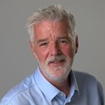
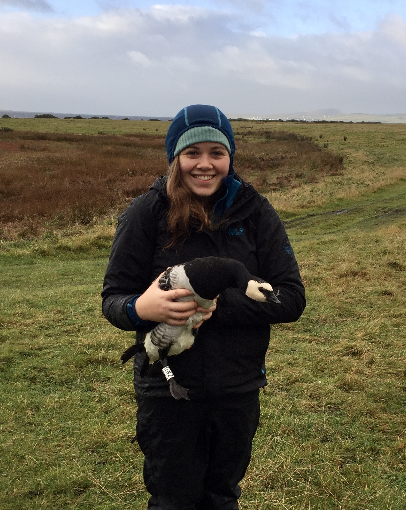
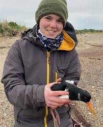
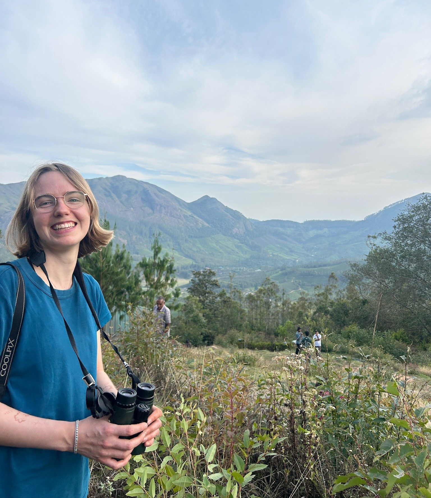
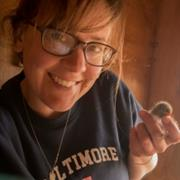
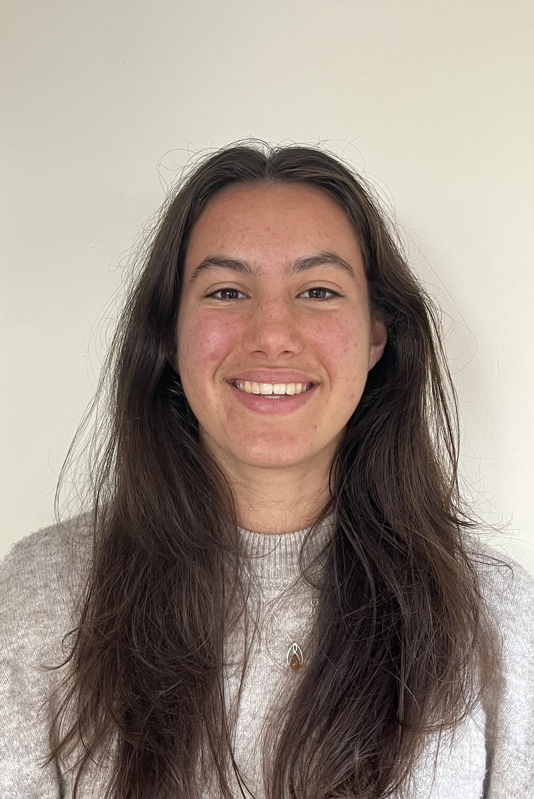

```{=html}
<style>

.people-grid {
  display: grid;
  grid-template-columns: repeat(3, 1fr);
  gap: 30px;
  align-items: start;
}

/* Card style */

.person {
  background: white;
  border-radius: 12px;
  padding: 20px;
  text-align: center;
  box-shadow: 0 3px 8px rgba(0,0,0,0.08);
  transition: transform 0.2s, box-shadow 0.2s;
}

.person:hover {
  transform: translateY(-4px);
  box-shadow: 0 8px 18px rgba(0,0,0,0.15);
}

.person img {
  width: 160px;
  height: 160px;
  object-fit: cover;
  border-radius: 50%;
}

.person summary {
  list-style: none;
  cursor: pointer;
}

.person summary::-webkit-details-marker {
  display: none;
}

.name {
  font-weight: 600;
  font-size: 1.1em;
  margin-top: 12px;
}

.dropdown {
  margin-top: 6px;
  font-size: 0.9em;
  color: #666;
}

.arrow {
  font-size: 0.9em;
}

details[open] .arrow {
  transform: rotate(180deg);
  display: inline-block;
}

.bio {
  margin-top: 15px;
  text-align: left;
  font-size: 0.95em;
  line-height: 1.5;
}

</style>
```


:::::::::::: people-grid

<details class="person">

<summary>



::: name
Stuart Bearhop
:::

::: dropdown
View bio [▼]{.arrow}
:::

</summary>

::: bio

**Principal Investigator**

**About me:**

I am an ecologist with a range of interests mainly related to migration and foraging ecology of vertebrates (particularly birds) and the application of stable isotope techniques in animal ecology. I am a member of the Ecology and Conservation research group. I am the Associate Pro-Vice-Chancellor, Global Engagement for the The Faculty of Environment, Science and Economy.

**Interests:**

My research focuses on spatial and trophic ecology of animals, with a particular interest in the causes and consequences of intra-population variation in movement and foraging behaviours. I also work on applications of stable isotope techniques. My research group works at field sites all over the world: UK, Ireland, Iceland, Iberia, Canadian Arctic, North Atlantic, west Africa, Kenya, Hong Kong, China

Email: S.Bearhop@exeter.ac.uk

:::

</details>


<details class="person">

<summary>



::: name
Aimee McIntosh
:::

::: dropdown
View bio [▼]{.arrow}
:::

</summary>

::: bio

**Post Doctoral Researcher**

Aimée is an ecologist with a broad interest animal movement, in particular the movement and foraging ecology of migratory species, and how this can be applied to inform conservation and management of these species. 

Aimée is currently a Postdoctoral research fellow at the University of Exeter where her research is aims to determine the causes and consequences of variation in physiological transformations of migratory geese funded by NERC.

During her PhD she assessed the impact of shooting management on the movement and foraging behaviour of the East Greenland flyway population of barnacle geese. She also worked with the AEWA European Goose Management Group to develop an integrated population model, to assess the demographic impact of cumulative shooting off take to inform the flyway-scale international management strategy.  

Email: a.l.s.mcintosh@exeter.ac.uk

[Google scholar](https://scholar.google.co.uk/citations?user=W67Z2DgAAAAJ&hl=en&oi=ao)

[Orcid ID](https://orcid.org/0000-0002-4975-3682)

:::

</details>


<details class="person">

<summary>


::: name
Luke Ozsanlav-Harris
:::

::: dropdown
View bio [▼]{.arrow}
:::

</summary>

::: bio

**Post Doctoral Researcher**

I am an ecologist with a broad interest in ornithology, animal movement, and applied ecological research. I am currently a Postdoctoral Research Associate at the University of Exeter, where my work focuses on understanding how birds move through, respond to, and persist in changing environments. Outside of research, I am an active birder and regularly document my observations locally and further afield, with photographs and checklists available on my eBird profile.

Email: l.ozsanlav-harris2@exeter.ac.uk

[Google Scholar](https://scholar.google.com/citations?user=9VyBol4AAAAJ&hl=en)

:::

</details>


<details class="person">

<summary>



::: name
Steph Trapp
:::

::: dropdown
View bio [▼]{.arrow}
:::

</summary>

::: bio

**Research Assistant**
Steph recently completed a PhD to understand the drivers and consequences of winter movement patterns and habitat use in wading birds, particularly the use of urban amenity grasslands in north Dublin. Her PhD was funded by Fingal County Council and involved GPS tracking four species of wading bird in and around Dublin Bay Biosphere. 

Email: st553@exeter.ac.uk

:::

</details>


<details class="person">

<summary>



::: name
Lucy Williamson
:::

::: dropdown
View bio [▼]{.arrow}
:::

</summary>

::: bio

**PhD Student**

Lucy is a second year PhD student carrying out a joint degree between the University of Exeter and University of Queensland (QUEX). Her research is focused on understanding population-level change in migratory birds over time and deriving strategies for their conservation. Using global citizen science data, eBird, she is researching how population dynamics are related to migratory strategies and anthropogenic change. She has broad interests in migratory species, ornithology, and applied conservation research. 

Email: lw829@exeter.ac.uk

[Univeristy profile](https://experts.exeter.ac.uk/44984-lucy-williamson)

[ORCID ID](https://orcid.org/0009-0006-6319-5310)

[Blusky](https://bsky.app/profile/lucywilliamson.bsky.social)

:::

</details>


<details class="person">

<summary>



::: name
Debs Allbrook
:::

::: dropdown
View bio [▼]{.arrow}
:::

</summary>

::: bio

**PhD Student**

Debs studies the ecology of Kittiwakes nesting on offshore platforms (in partnership with RSK Biocensus). 

Email: dla205@exeter.ac.uk

:::

</details>


<details class="person">

<summary>


::: name
Vance Mak
:::

::: dropdown
View bio [▼]{.arrow}
:::

</summary>

::: bio

**PhD Student**

Vance currently works at University of Exeter's Environment and Sustainability Institute under the supervision of Dr. Richard Sherley, Professor Stu Bearhop, and Dr. Alice Trevail at the University of Exeter, as well as partners in Bangor University (Professor Simon Neill), the Zoological Society of London (Dr. Catharine Horswill), and the Crown Estate (Sion Roberts). His research focuses on interactions between kittiwakes throughout the North Atlantic and offshore wind, with emphasis on animal movement data, ecological niche modelling, ocean and climate projection modelling, impact assessment analysis, and marine spatial planning.

Email: vm325@exeter.ac.uk

:::

</details>


<details class="person">

<summary>



::: name
Kate Mighell
:::

::: dropdown
View bio [▼]{.arrow}
:::

</summary>

::: bio

**PhD Student**

Kate is a PhD student at the University of Exeter looking at the impacts of insect declines on bird populations. She is interested in understanding if insects are driving the differences between different bird populations and how birds can mitigate insect losses. Her broader interest are drivers of population changes and trophic cascades. Outside of work she is regularly involved in bird ringing.

Email: km961@exeter.ac.uk

:::

</details>


::::::::::::
