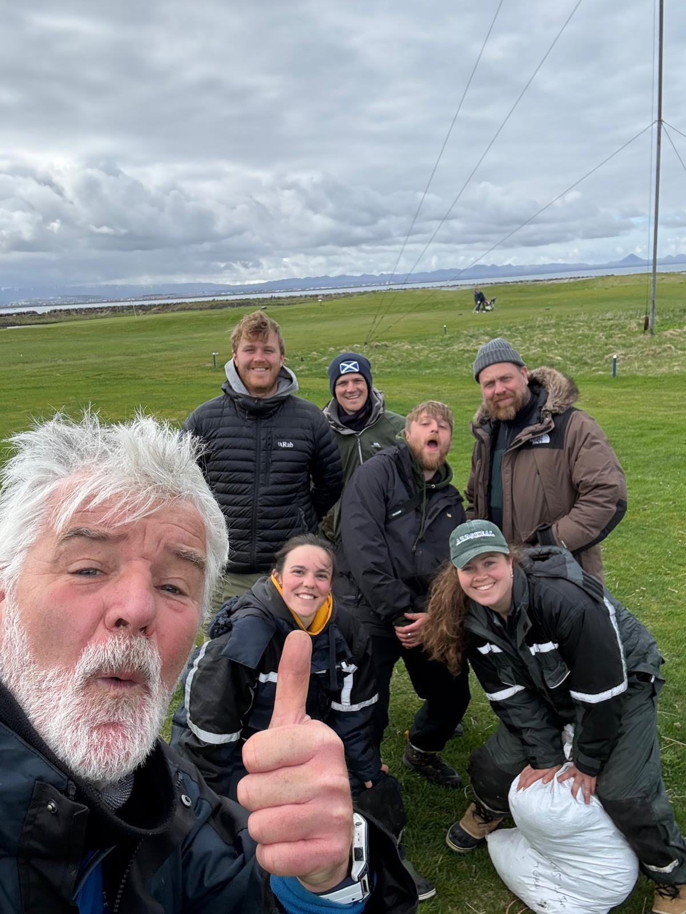

### Building flying machines from feeding machines: causes and consequences of body transformations in long distance migrants

::: column-margin

:::

::: column-margin
{width="80%"}
:::

INSERT MAIN TEXT HERE

**Aims:**

-   To understand the causes and consequences of body transformations in long distance migrants

------------------------------------------------------------------------

