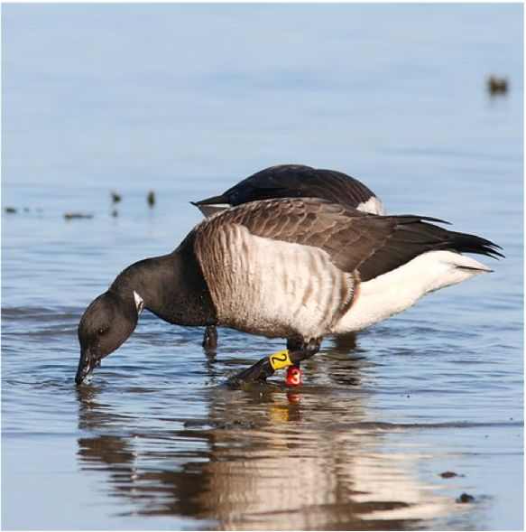

### Overview
This project aims to quantifying the causes and consequences of variation in antimicrobial resistance (AMR) transmission by migratory birds. The project will utilise individually-marked light-bellied Brent geese as a model system, understanding AMR dynamics across Ireland and Iceland. The aims of the project are to quantify i) the factors that shape individual resistome composition and dynamics; ii) the role of social interactions in shaping direct and indirect transmission of AMR and iii) the spatial scales at which migrants can spread AMR, including across different migratory stages. 

### Previous publications

:::: {.callout-tip collapse="true" appearance="minimal"}
##### Microbiome dynamics

[@marsh2024]

[@jones2023]

::::

{fig-align="center" width="40%"} 
