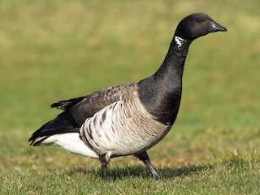
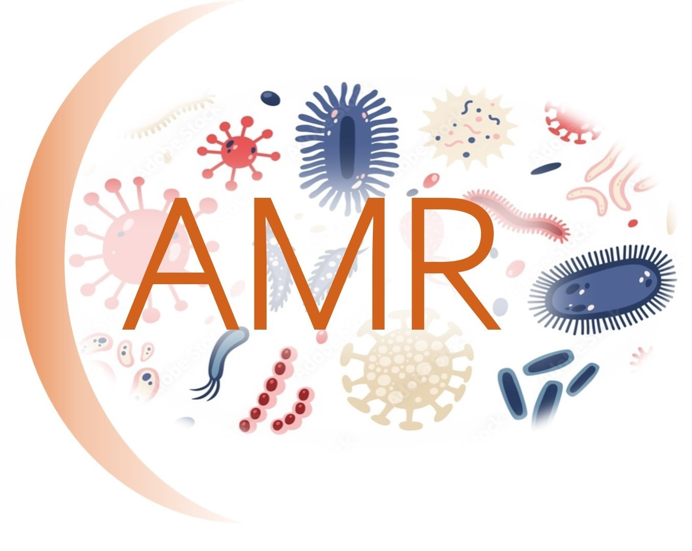

### Aims

Work in progress

### Previous publications

:::: {.callout-tip collapse="true" appearance="minimal"}
##### Microbiome dynamics

[@marsh2024]

[@jones2023]

::::

::: {.columns}
::: {.column width="50%"}

:::

::: {.column width="50%"}

:::
:::
