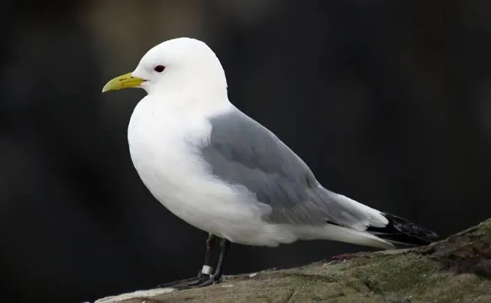

**Aims:**

Work in progress

:::: {.callout-tip collapse="true" appearance="minimal"}
##### Key publications

::: {style="font-size:16px"}
[@delahay2025]
:::
::::

::::: columns
::: {.column width="50%"}

:::
