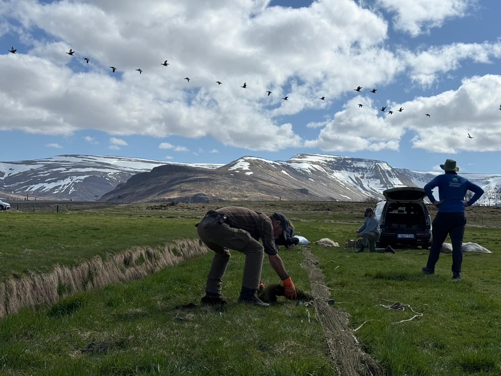
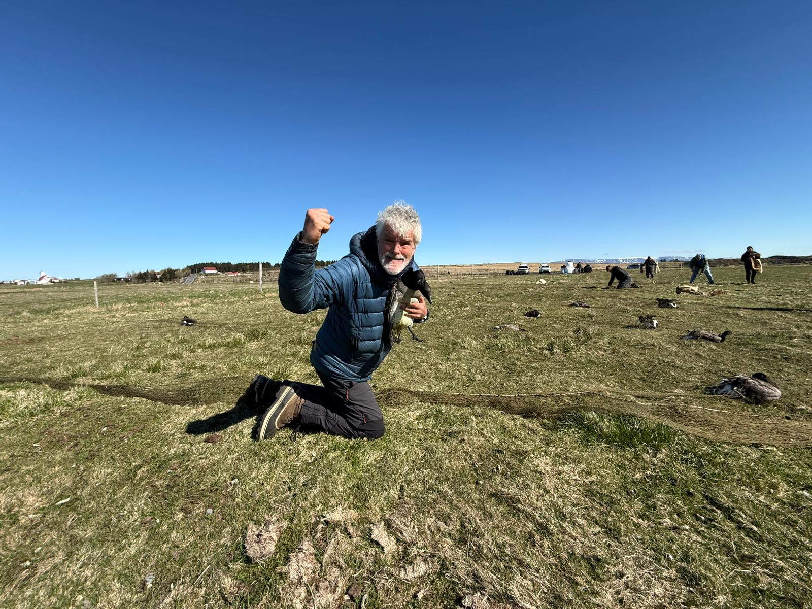
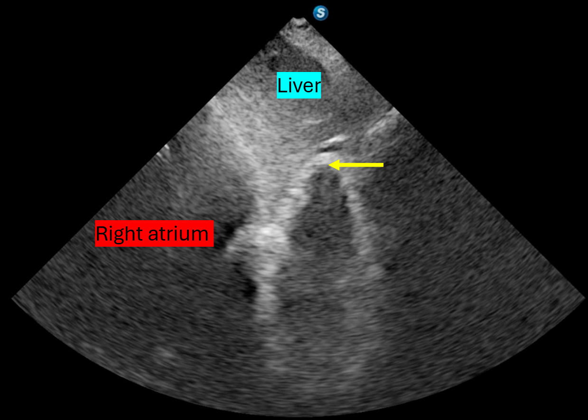
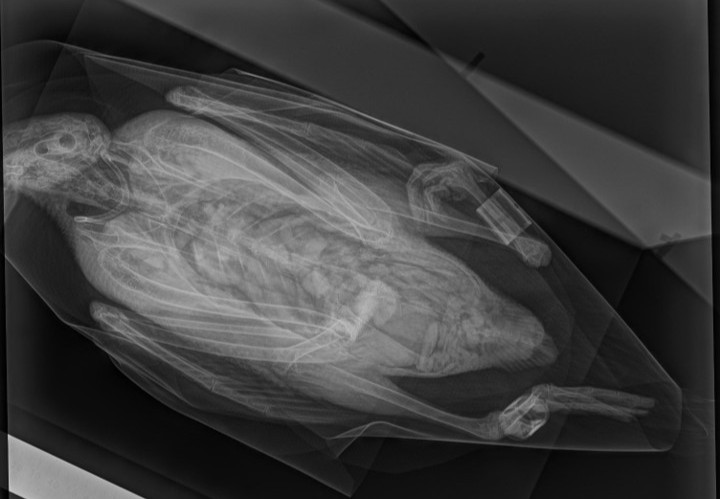

Studies of animal migration often throw up more questions than answers, particularly with respect to physiological performance. Of particular note is the remarkable ability of many of the more extreme migratory birds from a broad range of taxa to transform their physiology multiple times during the annual cycle as they switch between feeding and flying machines (during migration, the sizes of some organ systems can change by more than 50% as digestive systems regress while flight muscles are grown and stores laid down). These flexible phenotypes were first described over 30 years ago and individuals vary in the extent to which they transform, indicating that the changes must play a key role in shaping individual life histories and fitness. Despite this, we still have no real understanding of the consequences of such variation and the trade-offs at play. This is largely because there are few longitudinal studies of these morphological reorganisations, as until now measuring the changes has usually required sacrificing focal animals. In this project we aim to use x-ray radiography and ultrasonography on Light-bellied Brent Geese, to address this substantial gap in our knowledge. We will carry out longitudinal analyses of  birds during key phases of their annual cycles, measuring the drivers of variation in the extent and rate at which they transform, linking this to downstream consequences for the first time. From this we will understand how the trade-offs are managed, the consequences of individually variable strategies and the key processes that underpin them. 

 
**Aims:**
We will tackle the following broad questions: 

-   What causes variation in the timing and extent of individual transformations between feeding and flying machines? 

-   What are the consequences of individual variation in the timing and extent of the transformations between feeding and flying machines? 

:::: {.callout-tip collapse="true" appearance="minimal"}
##### Key publications

::: {style="font-size:16px"}
INSERT PULICATION HERE
:::
::::

::: {.columns}
::: {.column width="50%"}

:::

::: {.column width="50%"}

:::
:::

::: {.columns}
::: {.column width="50%"}

:::

::: {.column width="50%"}

:::
:::